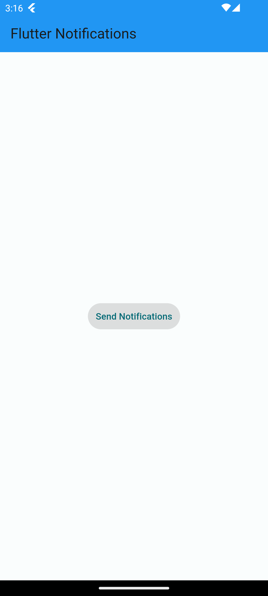
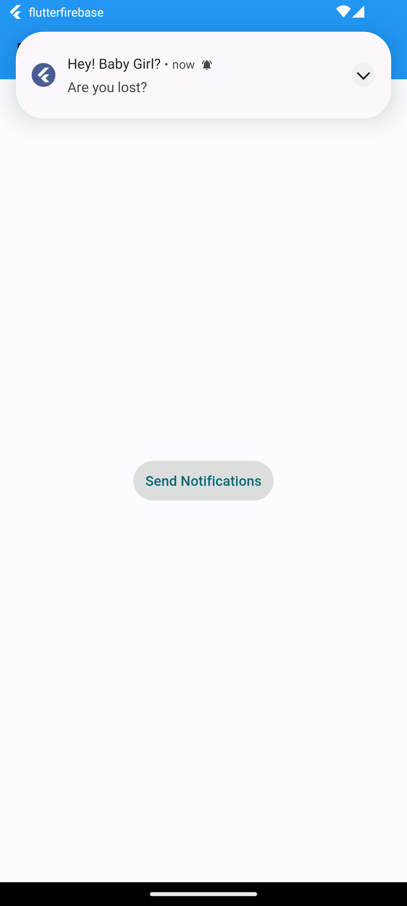
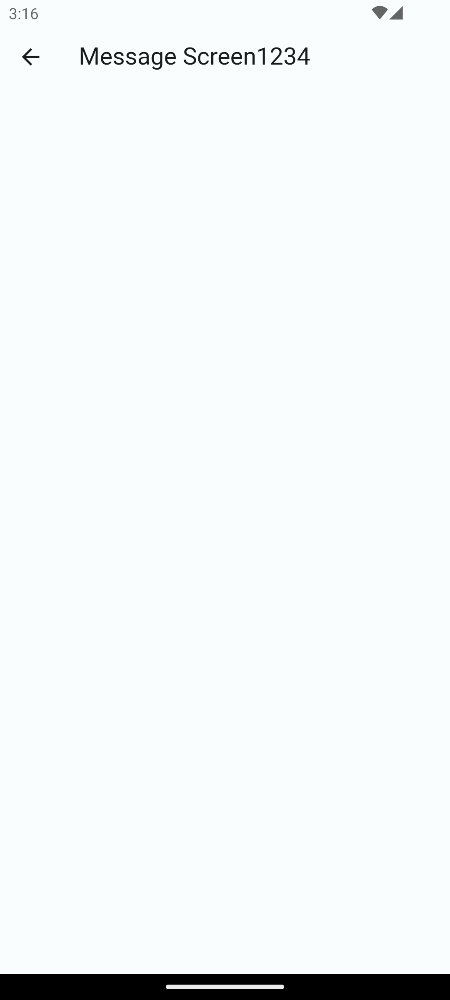

# Flutter Firebase Notifications

Welcome to the Flutter Firebase Notifications project! This project serves as a foundation for building Flutter applications with Firebase Cloud Messaging (FCM) integration, enabling you to send push notifications to your users seamlessly.

## Getting Started

If you're new to Flutter development or Firebase integration, fear not! We've got you covered with some helpful resources to kickstart your journey:

- **Lab: Write your first Flutter app**: Dive into this step-by-step codelab to familiarize yourself with Flutter basics. [Start here](https://docs.flutter.dev/get-started/codelab).
- **Cookbook: Useful Flutter samples**: Explore a variety of Flutter samples covering common scenarios and techniques. [Check it out](https://docs.flutter.dev/cookbook).
- **Online documentation**: For comprehensive guidance on Flutter development, including tutorials, samples, and a detailed API reference, refer to the [online documentation](https://docs.flutter.dev/).

## Firebase Cloud Messaging Integration

Firebase Cloud Messaging (FCM) is a powerful tool that allows you to send notifications and messages to your users across various platforms, including Android, iOS, and the web. By integrating FCM into your Flutter app, you can engage with your users in real-time, keeping them informed and engaged.

To integrate Firebase Cloud Messaging into your Flutter project, follow these steps:

1. **Set up Firebase Project**: Create a Firebase project in the [Firebase Console](https://console.firebase.google.com/) and add your Flutter app to it.
2. **Add Firebase SDK to Flutter Project**: Configure your Flutter project to use Firebase by adding the necessary Firebase SDK dependencies.
3. **Implement Push Notifications**: Implement push notification handling in your Flutter app, enabling it to receive and display notifications sent via Firebase Cloud Messaging.

- _For iOS_: I've already written the code for iOS notifications. However, since i don't have an Apple Developer Account, the part where users can see notifications in the UI hasn't been implemented yet.

4. **Test Notifications**: Test your notification setup to ensure that your Flutter app can successfully receive and display push notifications.

For detailed instructions on integrating Firebase Cloud Messaging into your Flutter app, refer to the official [Firebase Cloud Messaging documentation](https://firebase.flutter.dev/docs/messaging/overview).

## Screenshots

_Add your app screenshots here to provide a visual representation of your Flutter application._

Feel free to customize this project to suit your specific needs and preferences. Happy coding!
